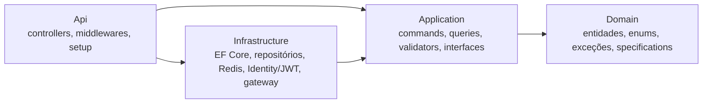

# Tech Curse API

[](https://github.com/tech-curse/tech-curse-api/actions/workflows/ci.yml)
[](https://github.com/tech-curse/tech-curse-api/tags)
[](https://dotnet.microsoft.com/)

API REST para uma plataforma de cursos — catálogo, estudantes, matrículas e pagamentos — em .NET 10 / C# 14, com Clean Architecture, CQRS por Vertical Slices (MediatR), PostgreSQL, Redis e autenticação JWT sobre ASP.NET Core Identity. O front-end é o [tech-curse-web](https://github.com/tech-curse/tech-curse-web).

> **Escopo.** Projeto pessoal, usado por um grupo pequeno de pessoas e mantido como portfólio. O gateway de pagamento é **simulado** (`SimulatedPaymentGatewayAdapter`) e, por isso, a aplicação **se recusa a subir com `ASPNETCORE_ENVIRONMENT=Production`**: um gateway que fabrica respostas confirmaria cobranças que nunca aconteceram. A decisão é tirar o módulo de pagamentos de produção até existir um gateway real ([issue #1](https://github.com/tech-curse/tech-curse-api/issues/1)).

## Sumário

- [Funcionalidades](#funcionalidades)
- [Arquitetura](#arquitetura)
- [Stack](#stack)
- [Como executar](#como-executar)
- [Como testar](#como-testar)
- [Configuração](#configuração)
- [Autenticação e papéis](#autenticação-e-papéis)
- [Endpoints](#endpoints)
- [Segurança](#segurança)
- [Versionamento](#versionamento)
- [Decisões e limitações conhecidas](#decisões-e-limitações-conhecidas)

## Funcionalidades

- **Cursos** — cadastro, edição, remoção e listagem paginada com filtro por categoria.
- **Estudantes** — perfil criado junto com o usuário no registro, consulta do próprio perfil (`/me`) e remoção lógica.
- **Matrículas** — matrícula em curso com checagem de duplicidade.
- **Pagamentos** — registro, processamento e estorno, com estratégia por meio de pagamento, especificação de elegibilidade e idempotência obrigatória via Redis.
- **Plataforma** — RBAC (`Admin`, `Instructor`, `Student`), refresh token com rotação, rate limiting, CORS configurável, logs estruturados com Serilog, Correlation ID e health checks de liveness e readiness.

## Arquitetura

Quatro projetos em `src/`, com dependências apontando para dentro:



| Camada | Responsabilidade |
| --- | --- |
| **Domain** | Entidades, enums, exceções de domínio e `ISpecification<T>`. Nenhuma dependência de outra camada, de EF Core ou de ASP.NET. |
| **Application** | Uma pasta por operação em `Features/<Recurso>/{Commands,Queries}/<Operacao>/`, cada uma com request, handler e validator. Define as interfaces que a infraestrutura implementa. |
| **Infrastructure** | `TechCurseContext`, repositórios, cache Redis, Identity/JWT e o adaptador do gateway de pagamento. |
| **Api** | Controllers finos que só conhecem `IMediator`, middlewares e a composição do container. |

Fluxo de uma requisição:

```
Controller → ExceptionHandlingMiddleware → CorrelationIdMiddleware → MediatR
           → ValidationBehavior (FluentValidation) → Handler → Repositório / Cache / Gateway
```

Handlers lançam exceções de domínio; o `ExceptionHandlingMiddleware` as converte em `ProblemDetails` com o status correspondente (404, 409, 422, 504…).

## Stack

| Área | Tecnologia |
| --- | --- |
| Runtime | .NET 10, C# 14, ASP.NET Core |
| Aplicação | MediatR 12, FluentValidation 12 |
| Persistência | EF Core 10, PostgreSQL 17 (Npgsql) |
| Cache e idempotência | Redis (StackExchange.Redis) |
| Identidade | ASP.NET Core Identity, JWT Bearer |
| Observabilidade | Serilog, health checks |
| Documentação | Swashbuckle (OpenAPI) |

Versões de pacote centralizadas em [`Directory.Packages.props`](Directory.Packages.props).

## Como executar

Pré-requisitos: [.NET 10 SDK](https://dotnet.microsoft.com/download/dotnet/10.0), PostgreSQL 17 e Redis.

```bash
git clone https://github.com/tech-curse/tech-curse-api.git
cd tech-curse-api
```

A API lê a configuração de variáveis de ambiente; nenhuma credencial é versionada. Em desenvolvimento, as variáveis ficam num `.env` local, fora do git:

```bash
cp .env.example .env
```

Preencha no `.env` as connection strings do seu PostgreSQL e do seu Redis e uma chave de assinatura gerada na hora (`openssl rand -base64 48`), no campo `Jwt__SigningKey`. Depois rode a API com o script, que carrega o `.env` e executa `dotnet run --project src/Api`:

```bash
./scripts/com-env.sh
```

No PowerShell, `./scripts/com-env.ps1`. Na IDE, aponte a run configuration para o arquivo `.env`. O script também roda outros comandos com as mesmas variáveis, por exemplo `./scripts/com-env.sh dotnet ef database update --project src/Infrastructure --startup-project src/Api`.

As migrations são aplicadas no startup. O porquê desta estrutura, e de onde a configuração vem em cada ambiente, está em [`docs/configuracao.md`](docs/configuracao.md).

| Recurso | Endereço |
| --- | --- |
| Swagger | http://localhost:5130/swagger |
| Liveness | http://localhost:5130/health/live |
| Readiness | http://localhost:5130/health/ready |

### Admin de desenvolvimento

Em `Development`, a API cria um usuário `Admin` no startup a partir de `Seed:Admin:Email` e `Seed:Admin:Password`, lidos de variáveis de ambiente (`Seed__Admin__Email` e `Seed__Admin__Password` no `.env`). A criação é idempotente e não acontece em nenhum outro ambiente. Deixe as chaves vazias para não semear, ou troque a senha se a máquina for acessível a outras pessoas.

## Como testar

Pré-requisito: Docker em execução. Os testes de integração sobem um PostgreSQL 17 e um Redis 7 reais com o Testcontainers; nenhuma configuração ou `.env` é necessária.

```bash
dotnet test --solution TechCurse.slnx
```

| Projeto | O que cobre |
| --- | --- |
| `tests/TechCurse.Api.IntegrationTests` | A API de ponta a ponta (`WebApplicationFactory`), contra PostgreSQL e Redis reais |
| `tests/TechCurse.UnitTests` | Regras puras de domínio e aplicação, sem I/O |

Cada teste declara o cenário da [especificação](docs/especificacoes/README.md) que cobre. Para ver quais cenários implementados ainda não têm teste:

```bash
python scripts/rastreabilidade.py
```

Cobertura de código, no mesmo formato do CI:

```bash
dotnet test --solution TechCurse.slnx --results-directory TestResults --coverage --coverage-output-format cobertura
dotnet tool restore
dotnet reportgenerator "-reports:TestResults/**/*.cobertura.xml" -targetdir:TestResults/relatorio -reporttypes:Html
```

Para exercitar os endpoints à mão, use o Swagger ou a collection do Postman em [`docs/postman_collection.json`](docs/postman_collection.json).

## Configuração

A configuração vem de variáveis de ambiente; o `appsettings.json` só traz padrões seguros, iguais em todo ambiente. Não há `appsettings.<Ambiente>.json` nem User Secrets. Em variáveis de ambiente, as chaves usam `__` no lugar de `:` (ex.: `Jwt__SigningKey`). O [`.env.example`](.env.example) lista todas as variáveis que a API lê: os segredos sem valor e o resto com um valor de exemplo de desenvolvimento.

| Chave | Descrição |
| --- | --- |
| `ConnectionStrings:APITechCurse` | Connection string do PostgreSQL (formato Npgsql) |
| `ConnectionStrings:RedisCache` | Endereço do Redis |
| `Jwt:Issuer`, `Jwt:Audience` | Emissor e audiência do token |
| `Jwt:SigningKey` | Chave de assinatura, mínimo de 32 caracteres. Gere com `openssl rand -base64 48` |
| `Jwt:RefreshTokenDays` | Validade do refresh token (padrão `7`) |
| `Cors:AllowedOrigins` | Origens permitidas, separadas por vírgula. Vazio desliga o CORS |
| `RateLimiting:Enabled` | Liga o rate limiting (padrão `true`) |
| `RateLimiting:GlobalPermitLimit` / `GlobalWindowSeconds` | Limite global (padrão 200 por 60 s) |
| `RateLimiting:AuthPermitLimit` / `AuthWindowSeconds` | Limite dos endpoints de autenticação (padrão 10 por 60 s) |
| `Seed:Admin:Email`, `Seed:Admin:Password` | Admin semeado em `Development` |

## Autenticação e papéis

| Papel | Acesso |
| --- | --- |
| `Admin` | Todos os recursos, incluindo pagamentos e gestão de usuários |
| `Instructor` | Criação de cursos |
| `Student` | Próprio perfil, próprias matrículas e pagamentos |

O registro público (`POST /tech-curse/Auth/register`) cria sempre um `Student`, já com o perfil de estudante. Outros papéis só são criados por um `Admin`, em `POST /tech-curse/Auth/users`.

Para usar o Swagger: faça login em `POST /tech-curse/Auth/login`, clique em **Authorize** e informe `Bearer <token>`.

## Endpoints

Todas as rotas ficam sob `/tech-curse/<Controller>`, com o nome do controller no singular. A referência completa está no Swagger, e a collection do Postman em [`docs/postman_collection.json`](docs/postman_collection.json) cobre todas as rotas — o login grava o token nas variáveis da collection.

| Recurso | Operações |
| --- | --- |
| `Auth` | registro, login, refresh e criação de usuário por Admin |
| `Course` | listagem paginada, detalhe, criação, edição e remoção |
| `Student` | listagem, detalhe, `/me`, matrículas do aluno, edição e remoção lógica |
| `Enrollment` | matrícula em curso |
| `Payment` | consultas por id, aluno e matrícula; registro, processamento e estorno |
| `/health/live`, `/health/ready` | liveness e readiness |

As escritas de pagamento exigem o header **`Idempotency-Key`**; sem ele a resposta é 400.

## Segurança

| Mecanismo | Implementação |
| --- | --- |
| Refresh token | Persistido como hash SHA-256, comparado em tempo constante, com rotação a cada uso |
| Rate limiting | Limite global por usuário ou IP e política mais restrita na autenticação; rejeição em `ProblemDetails` 429 com `Retry-After` |
| Lockout | Configurado no Identity (5 tentativas, 15 minutos), mas **ainda não aplicado**: o login chama `CheckPasswordSignInAsync` com `lockoutOnFailure: false`. O rate limiting da autenticação é a única barreira contra força bruta hoje |
| Autorização | RBAC por papel no controller; regras de posse ("é o próprio aluno") nos handlers |
| Data Protection | Chaveiro persistido no banco, sem chaves efêmeras no sistema de arquivos |
| Health checks | Readiness expõe só o status agregado; o detalhe por dependência exige `Admin` |
| Idempotência | Respostas de escrita de pagamento repetidas a partir do Redis |

## Versionamento

O projeto segue [Semantic Versioning](https://semver.org/lang/pt-BR/); a versão vigente e o histórico de mudanças estão no [CHANGELOG](CHANGELOG.md).

## Decisões e limitações conhecidas

- **Gateway de pagamento simulado.** Não há integração com um provedor real, e a aplicação aborta em `Production` por isso. O módulo de pagamentos vai ficar fora de produção até a [issue #1](https://github.com/tech-curse/tech-curse-api/issues/1).
- **Soft delete restrito ao aluno.** Um aluno removido não faz seus pagamentos sumirem de consultas e relatórios.
- **Migrations aplicadas no startup.** Uma falha de migration impede a API de subir. Com várias réplicas, o caminho adequado seria um job de migração dedicado antes do rollout.
- **Rate limiting em memória, por instância.** Com N réplicas, o limite efetivo é N vezes o configurado.
- **Um refresh token por usuário.** Um login em outro dispositivo invalida a sessão anterior.
- **Sem testes automatizados, imagem de contêiner nem pipeline de entrega.** Estão sendo reconstruídos do zero; o CI de build e formatação já roda em todo pull request.

## Contribuindo

Desenvolvimento trunk-based: branch curta a partir de `main`, pull request com título em [Conventional Commits](https://www.conventionalcommits.org/pt-br/) e squash merge. Veja o [guia de contribuição](https://github.com/tech-curse/.github/blob/main/CONTRIBUTING.md) da organização.
